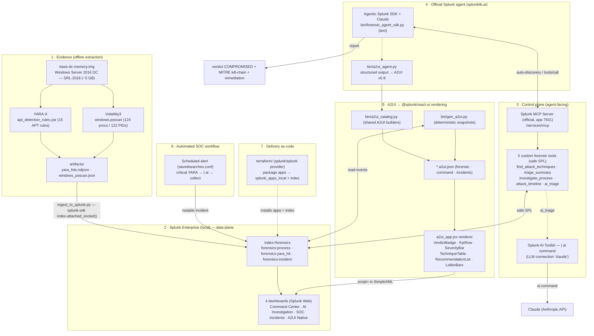

# Architecture — Find Evil: Agentic Memory Forensics

> Architecture required by the hackathon: how the project interacts with Splunk,
> how AI models/agents are integrated, and how data flows between services.
> The whole project runs **inside Splunk** and is delivered **as code (Terraform)**.

## Overview

## The A2UI rendering layer (the UI differentiator)

Instead of dumping verbose Markdown or static charts, **all four dashboards** are
driven by **A2UI** (Agent-to-UI v0.9, https://a2ui.org). The agent emits an A2UI
document with an **enriched component catalog**; a single React renderer
([`web/splunk_react/src/a2ui_app.jsx`](web/splunk_react/src/a2ui_app.jsx)) maps each
component to a dense, native **`@splunk/react-ui`** control:

| A2UI component | Splunk control |
|---|---|
| `VerdictBadge` | colored verdict banner (COMPROMISED / SUSPICIOUS / CLEAN) |
| `KpiRow` | KPI cards (critical / high / techniques / processes) |
| `SeverityBar` | segmented severity bar + legend |
| `TechniqueTable` | `@splunk/react-ui` Table with severity chips |
| `RecommendationList` | prioritized remediation items |
| `LolbinBars` / `IncidentList` | LOLBin usage bars / SOC incident cards |
| `Collapsible` | the long analysis, folded by default (info-first) |

Each dashboard is a thin SimpleXML shell that mounts the renderer (`script=`) on a
`
.a2ui.json">`. Snapshots come from two sources that
share the same catalog ([`bin/a2ui_catalog.py`](splunk_app/find_evil/bin/a2ui_catalog.py)):

- **`bin/a2ui_agent.py`** — the official `splunklib.ai` agent reasons with Claude and
  emits the forensic report as A2UI (`forensic_report.a2ui.json`).
- **`bin/gen_a2ui.py`** — a deterministic generator that reads the index and renders
  the command-overview and SOC-incident snapshots (no LLM latency for those views).

## Data flow

1. **Extraction** — `yara_scan.py` (YARA-X) and `vol_extract.py` (Volatility3) write JSON to `artifacts/`.
2. **Ingestion** — `ingest_to_splunk.py` streams the artifacts into the `forensics` index using
   the official **splunk-sdk-python** (`index.attached_socket()` → `receivers/stream`), with the
   `forensics_ingest` TA providing CIM-aligned `props.conf` (JSON parsing, correct 2018 `_time`).
3. **Exposure** — the official **Splunk MCP Server** exposes 5 custom forensic tools (safe SPL).
4. **Official agent** — the **Agentic Splunk SDK** (`splunklib.ai`) connects to Splunk,
   **auto-discovers the MCP tools**, reasons with Claude, and produces a structured verdict
   (text via `forensic_agent_sdk.py`, or **A2UI** via `a2ui_agent.py`).
5. **AI inside SPL** — the `ai_triage` tool runs the AI Toolkit's **`| ai`** command (LLM native to SPL).
6. **Rendering** — A2UI snapshots are rendered as `@splunk/react-ui` controls across all 4 dashboards.
7. **SOC workflow** — a scheduled alert detects critical detections, runs AI triage (`| ai`) and writes a
   **notable incident** (`forensics:incident`) → *SOC Incidents* dashboard.

## Splunk AI capabilities

| Capability | Component |
|---|---|
| **Splunk MCP Server** (official) | `/services/mcp` + 5 custom forensic tools |
| **Splunk AI Toolkit** (`\| ai`) | `forensics_ai_triage` tool + SOC workflow |
| **Agentic Splunk SDK** (`splunklib.ai`) | official agent (text + A2UI output) |
| **A2UI v0.9** | enriched catalog → `@splunk/react-ui` controls on every dashboard |

## Delivery as code

The whole deployment is reproducible with the official **Splunk Terraform provider**
(`splunk/splunk`) — see [`terraform/`](terraform/). `terraform apply`:

1. packages `splunk_app/find_evil` and `splunk_app/forensics_ingest` into `.spl`;
2. installs both via `splunk_apps_local` (the TA provisions the `forensics` index).

Validated end-to-end against the local instance: non-destructive install (vendored
SDK and `local/` overrides preserved) and idempotent (`No changes` on re-plan).

## Ports & services (local)

| Service | Port |
|---|---|
| Splunk Web (dashboards) | 8000 |
| Splunk management — REST, `/services/mcp`, `receivers/stream` ingestion | 8089 |
