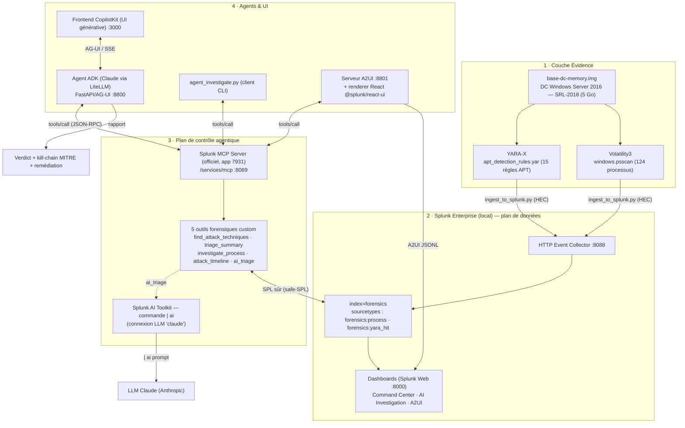

# Architecture — Find Evil : Agentic Memory Forensics

> Diagramme d'architecture requis par le hackathon : interaction avec Splunk,
> intégration des modèles/agents IA, et flux de données entre services.

## Vue d'ensemble

## Flux de données (séquence)

1. **Extraction** — `yara_scan.py` (YARA-X) et `vol_extract.sh` (Volatility3) analysent
   l'image mémoire → artefacts JSON (détections + processus).
2. **Ingestion** — `ingest_to_splunk.py` pousse les artefacts dans l'index `forensics`
   via le **HTTP Event Collector**, en préservant l'heure réelle des événements
   (`_time` = heure de création des processus / d'acquisition).
3. **Exposition** — le **Splunk MCP Server** officiel expose 5 outils forensiques
   custom (enregistrés via `/services/mcp_tools`), qui traduisent des intentions
   d'investigation en **SPL sûr** (whitelist safe-SPL) contre l'index `forensics`.
4. **Raisonnement IA — 2 chemins** :
   - **Dans Splunk** : l'outil `ai_triage` exécute la commande **`| ai`** de l'AI
     Toolkit → envoie les détections au LLM Claude → verdict natif SPL.
   - **Agent** : l'**agent ADK (Claude)** appelle les outils via `tools/call`
     (JSON-RPC), orchestre l'investigation et produit un rapport d'incident MITRE.
5. **Restitution** — trois surfaces : frontend **CopilotKit** (UI générative via
   AG-UI), **dashboards Splunk** (Command Center, AI Investigation), et rendu
   **A2UI** en composants React natifs Splunk (`@splunk/react-ui`).

## Capacités Splunk AI utilisées

| Capacité | Rôle | Composant |
|---|---|---|
| **Splunk MCP Server** (officiel) | Plan de contrôle de l'agent | `/services/mcp` |
| **Outils MCP custom** | 5 outils forensiques métier | `forensic_mcp_tools.json` |
| **Splunk AI Toolkit** (`\| ai`) | Raisonnement IA natif SPL | `forensics_ai_triage` |

## Ports & services (local)

| Service | Port |
|---|---|
| Splunk Web | 8000 |
| Splunk management / MCP (`/services/mcp`) | 8089 |
| HTTP Event Collector | 8088 |
| Agent ADK (AG-UI) | 8800 |
| Serveur A2UI | 8801 |
| Frontend CopilotKit | 3000 |
