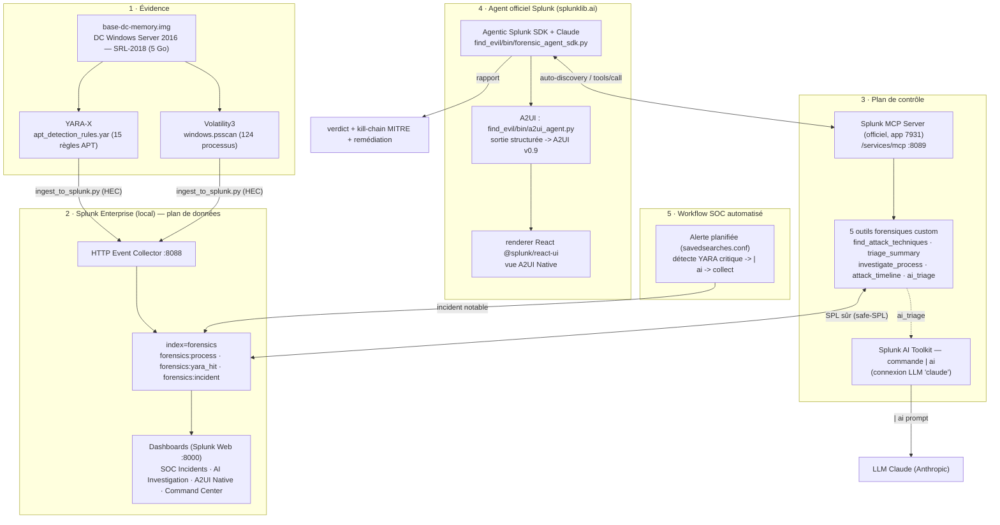

# Architecture — Find Evil : Agentic Memory Forensics

> Diagramme d'architecture requis par le hackathon : interaction avec Splunk,
> intégration des modèles/agents IA, et flux de données entre services.
> Projet recentré sur l'**agent officiel Splunk** (`splunklib.ai`).

## Vue d'ensemble

## Flux de données

1. **Extraction** — `yara_scan.py` (YARA-X) et `vol_extract.py` (Volatility3) → artefacts JSON.
2. **Ingestion** — `ingest_to_splunk.py` pousse les artefacts dans l'index `forensics` via HEC.
3. **Exposition** — le **Splunk MCP Server** officiel expose 5 outils forensiques custom (SPL sûr).
4. **Agent officiel** — l'**Agentic Splunk SDK** (`splunklib.ai`) se connecte au service Splunk,
   **auto-découvre les outils du MCP Server**, raisonne avec Claude, et produit :
   - un **verdict texte** (`forensic_agent_sdk.py`), ou
   - une **sortie A2UI v0.9** (`a2ui_agent.py`) rendue en composants `@splunk/react-ui`.
5. **IA dans le SPL** — l'outil `ai_triage` exécute la commande **`| ai`** de l'AI Toolkit (LLM natif SPL).
6. **Workflow SOC** — une alerte planifiée détecte les détections critiques, lance le triage IA
   (`| ai`) et écrit un **incident notable** (`forensics:incident`) → dashboard *SOC Incidents*.

## Capacités Splunk AI

| Capacité | Composant |
|---|---|
| **Splunk MCP Server** (officiel) | `/services/mcp` + 5 outils custom |
| **Splunk AI Toolkit** (`\| ai`) | outil `forensics_ai_triage` + workflow |
| **Agentic Splunk SDK** (`splunklib.ai`) | agent officiel (texte + A2UI) |

## Ports & services (local)

| Service | Port |
|---|---|
| Splunk Web | 8000 |
| Splunk management / MCP (`/services/mcp`) | 8089 |
| HTTP Event Collector | 8088 |
