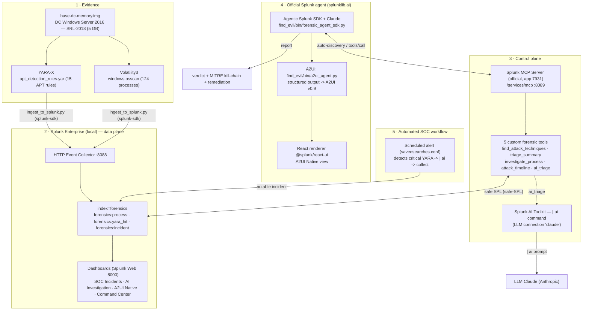

# Architecture — Find Evil: Agentic Memory Forensics

> Architecture diagram required by the hackathon: interaction with Splunk,
> integration of AI models/agents, and data flow between services.
> Project refocused on the **official Splunk agent** (`splunklib.ai`).

## Overview

## Data flow

1. **Extraction** — `yara_scan.py` (YARA-X) and `vol_extract.py` (Volatility3) → JSON artifacts.
2. **Ingestion** — `ingest_to_splunk.py` pushes the artifacts into the `forensics` index via the SDK (index.attached_socket) + props.conf.
3. **Exposure** — the official **Splunk MCP Server** exposes 5 custom forensic tools (safe SPL).
4. **Official agent** — the **Agentic Splunk SDK** (`splunklib.ai`) connects to the Splunk service,
   **auto-discovers the MCP Server tools**, reasons with Claude, and produces:
   - a **text verdict** (`forensic_agent_sdk.py`), or
   - an **A2UI v0.9 output** (`a2ui_agent.py`) rendered as `@splunk/react-ui` components.
5. **AI inside SPL** — the `ai_triage` tool runs the AI Toolkit's **`| ai`** command (LLM native to SPL).
6. **SOC workflow** — a scheduled alert detects the critical detections, launches AI triage
   (`| ai`) and writes a **notable incident** (`forensics:incident`) → *SOC Incidents* dashboard.

## Splunk AI capabilities

| Capability | Component |
|---|---|
| **Splunk MCP Server** (official) | `/services/mcp` + 5 custom tools |
| **Splunk AI Toolkit** (`\| ai`) | `forensics_ai_triage` tool + workflow |
| **Agentic Splunk SDK** (`splunklib.ai`) | official agent (text + A2UI) |

## Ports & services (local)

| Service | Port |
|---|---|
| Splunk Web | 8000 |
| Splunk management / MCP (`/services/mcp`) | 8089 |
| HTTP Event Collector | 8088 |
