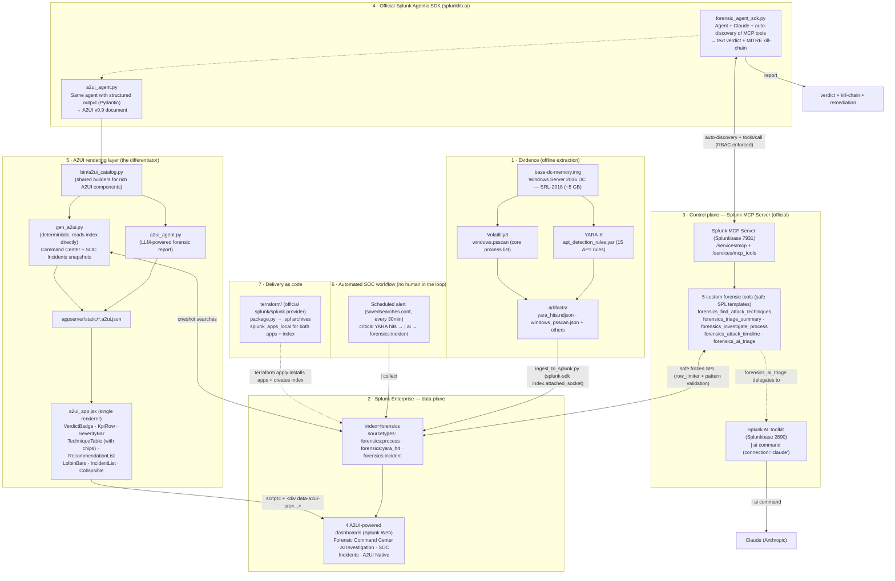

# Architecture — Find Evil: Agentic Memory Forensics

> Architecture required by the hackathon: how the project interacts with Splunk,
> how AI models/agents are integrated, and how data flows between services.
> The whole project runs **inside Splunk** (RBAC-respecting) and is delivered **as code (Terraform)**.

## What we actually built

Find Evil turns a Splunk instance into a **queryable forensic database** for memory images and exposes it to the **official Splunk Agentic SDK** (`splunklib.ai`) via the official **Splunk MCP Server**.

We implemented two complementary AI reasoning paths:

1. **Official Splunk agent path** (`splunklib.ai`): A Python agent (deployed as part of the `find_evil` app) connects to the local Splunk service, **auto-discovers the custom MCP tools**, reasons with Claude (direct Anthropic API), and produces either plain text or structured output that we convert to A2UI.
2. **AI inside SPL path** (`| ai`): The Splunk AI Toolkit's `| ai` command lets the LLM reason **natively inside the search engine**. We expose this as the `forensics_ai_triage` MCP tool and use it in a scheduled SOC workflow that automatically creates notable incidents.

All output (whether from the SDK agent or from `| ai`) is rendered as **dense native Splunk UI** (not raw Markdown) thanks to an A2UI v0.9 renderer using `@splunk/react-ui` components.

Everything is packaged and deployed reproducibly with the official Splunk Terraform provider.

## Overview



## The A2UI rendering layer (the UI differentiator)

Instead of dumping verbose Markdown or static charts, **all four dashboards** are driven by **A2UI** (Agent-to-UI v0.9, https://a2ui.org).

We built an **enriched component catalog** on top of the basic A2UI spec. A single React renderer
([`web/splunk_react/src/a2ui_app.jsx`](web/splunk_react/src/a2ui_app.jsx), served as `a2ui_react.js`)
maps each high-level component to dense, native **`@splunk/react-ui`** controls:

| A2UI component (our catalog) | Rendered as |
|---|---|
| `VerdictBadge` | Colored verdict banner with icon (COMPROMISED / SUSPICIOUS / CLEAN) |
| `KpiRow` | Row of KPI cards (Critical / High / Techniques / Processes) |
| `SeverityBar` | Segmented horizontal severity bar + legend with counts |
| `TechniqueTable` | `@splunk/react-ui` Table with colored SevChip pills + MITRE codes |
| `RecommendationList` | Prioritized remediation cards (P1 Immediate, etc.) |
| `LolbinBars` | Horizontal usage bars for in-memory LOLBins (powershell, cmd, ntdsutil...) |
| `IncidentList` | SOC incident cards with verdict + AI analysis (collapsible) |
| `Collapsible` | Foldable detailed analysis section (info-first design) |

Each dashboard is a very thin SimpleXML shell that only contains a banner and a mounting point:

```xml
<div data-a2ui-src="/static/app/find_evil/command.a2ui.json" style="min-height:640px;"></div>
```

The script (`a2ui_react.js`) discovers these divs and renders the corresponding A2UI snapshot.

### Two sources of A2UI snapshots (shared catalog)

Both sources use the exact same builders in [`bin/a2ui_catalog.py`](splunk_app/find_evil/bin/a2ui_catalog.py):

- **`bin/a2ui_agent.py`** — The official `splunklib.ai` agent runs with a Pydantic `output_schema` (`ForensicReport`), gets structured data from the tools, then calls `cat.build_forensic(...)` to emit a full A2UI document (`forensic_report.a2ui.json`). This is the LLM-powered incident report.
- **`bin/gen_a2ui.py`** — A deterministic generator (no LLM call at generation time). It runs oneshot searches against the `forensics` index and builds:
  - `command.a2ui.json` (Forensic Command Center — KPIs, severity, techniques, LOLBins)
  - `incidents.a2ui.json` (SOC Incidents list)
  It can also reuse the `forensic_report.a2ui.json` produced by the agent for the AI Investigation view.

This dual-source design gives us both rich agent reasoning **and** fast, always-fresh operational dashboards.

## Data flow

1. **Extraction (offline)** — `yara_scan.py` (YARA-X against the memory image + 15 custom rules) and `vol_extract.py` (Volatility3 `windows.psscan` + supporting plugins) produce NDJSON/JSON in `artifacts/`. The memory image itself is never committed.

2. **Ingestion** — `ingest_to_splunk.py` uses the official **splunk-sdk-python** (`index.attached_socket()` → streaming to `receivers/stream`) to push events. The thin `forensics_ingest` TA (`props.conf`) provides index-time JSON extraction and correct `_time` handling for 2018-era events (`MAX_DAYS_AGO` override).

3. **MCP tool exposure** — The 5 custom tools are registered via `/services/mcp_tools` (see `forensic_mcp_tools_all.json`). Each tool is a **frozen SPL template** with input validation (`pattern` constraints + optional row limiter). The agent only ever sees safe, pre-approved searches. Tool names as seen by the SDK agent are prefixed: `forensics_find_attack_techniques`, `forensics_triage_summary`, `forensics_investigate_process`, `forensics_attack_timeline`, `forensics_ai_triage`.

4. **Official agent investigation (splunklib.ai)** — `forensic_agent_sdk.py` and `a2ui_agent.py` (deployed in `find_evil/bin/`) connect to the local Splunk service, let the Agentic SDK **auto-discover** the MCP tools, and reason with Claude. The SDK enforces RBAC (the user must have `mcp_tool_execute` etc.). One variant asks for plain text; the structured variant (`a2ui_agent.py`) requests a Pydantic model and converts the result to A2UI.

5. **AI inside the search engine (`| ai`)** — The `forensics_ai_triage` tool (and the scheduled SOC alert) run an SPL pipeline that ends with `| ai connection="claude" prompt="..."`. This executes the LLM **inside Splunk's search process**, not in an external Python agent. The AI Toolkit handles the connection and capability checks (`apply_ai_commander_command`).

6. **Rendering** — A2UI JSONL documents (created either by the agent or by the deterministic generator) are mounted in SimpleXML dashboards and rendered client-side by the React bundle into native Splunk controls.

7. **Automated SOC loop** — A scheduled saved search (`Find Evil - Auto Triage Workflow` in `savedsearches.conf`) runs every 30 minutes: detect critical YARA hits → run `| ai` for verdict/kill-chain/recommendations → `| collect` a `forensics:incident` event → visible in the SOC Incidents dashboard. The alert must be owned by a user with the AI Toolkit capability.

## Splunk AI capabilities used

| Capability | How we use it |
|---|---|
| **Splunk MCP Server** (official, Splunkbase 7931) | Exposes `/services/mcp`. We register 5 custom forensic tools via `/services/mcp_tools` (safe SPL only). The official SDK agent auto-discovers them. |
| **Custom MCP tools (our implementation)** | 5 tools with frozen SPL templates: `forensics_*`. One of them (`forensics_ai_triage`) delegates to the AI Toolkit. All tool calls go through Splunk RBAC. |
| **Splunk AI Toolkit** (`\| ai` command, Splunkbase 2890) | Powers native-in-SPL reasoning. Used by the `ai_triage` MCP tool and (most importantly) by the scheduled SOC workflow that creates incidents with no manual intervention. |
| **Agentic Splunk SDK** (`splunklib.ai`, part of splunk-sdk 3.x) | The real star: `bin/*.py` scripts use `from splunklib.ai import Agent, AnthropicModel`. The SDK handles tool discovery against the MCP Server, conversation management, and (in `a2ui_agent.py`) structured output via Pydantic. The agent runs as a Splunk app script (vendored SDK in `lib/`). |
| **A2UI v0.9 + our enriched catalog** | The bridge from agent output to beautiful Splunk UI. One React renderer turns our high-level components into production-grade `@splunk/react-ui` controls on all four dashboards. |

## Delivery as code

The entire solution (two apps + the `forensics` index) is delivered with the official **Splunk Terraform provider** (`splunk/splunk`).

See [`terraform/`](terraform/):
- `package.py` builds versioned `.spl` archives from `splunk_app/find_evil` and `splunk_app/forensics_ingest` (triggered by file hash in a `null_resource`).
- `main.tf` uses `splunk_apps_local` resources to install them idempotently.
- The `forensics_ingest` TA creates the index at install time.

This was validated end-to-end: `terraform apply` on a clean Splunk, then again (`No changes`). The vendored `splunk-sdk[ai]` inside the app and any local overrides are preserved.

## Ports & services (local)

| Service | Port | Notes |
|---|---|---|
| Splunk Web (dashboards + A2UI rendering) | 8000 | The four A2UI dashboards live here |
| Splunk management / REST | 8089 | MCP Server (`/services/mcp`), tool registration (`/services/mcp_tools`), streaming ingestion (`receivers/stream`), agent connections |
| (Optional) HEC | 8088 | Not used in the current pipeline (we use the SDK socket) |

## Key things we actually implemented (for the judges)

- 5 production-grade custom MCP tools with safe, frozen SPL (no arbitrary search from the agent).
- Full use of the **official Agentic Splunk SDK** (`splunklib.ai`): auto tool discovery against our MCP Server, RBAC, conversation handling, and structured output (Pydantic) for one of the agents.
- Real dual-path AI: the same Claude model can be invoked either from the external SDK agent **or** via `| ai` inside a Splunk search (powering both the `ai_triage` tool and the automated SOC alert).
- A non-trivial A2UI v0.9 implementation: enriched catalog + one reusable React renderer that turns agent (or deterministic) output into polished `@splunk/react-ui` experiences on four different dashboards.
- A working scheduled alert that closes the Detect → Investigate (`| ai`) → Automate (`| collect` incident) loop with no human intervention.
- End-to-end "as code" deployment (Terraform + packaging) that was actually tested and is idempotent.
- All the forensic extraction/ingestion glue (`YARA-X`, Volatility3, `splunk-sdk` streaming) to make the demo real on a public SRL-2018 memory image.

The architecture deliberately stays inside Splunk's security model instead of building a sidecar agent that talks directly to an LLM.
