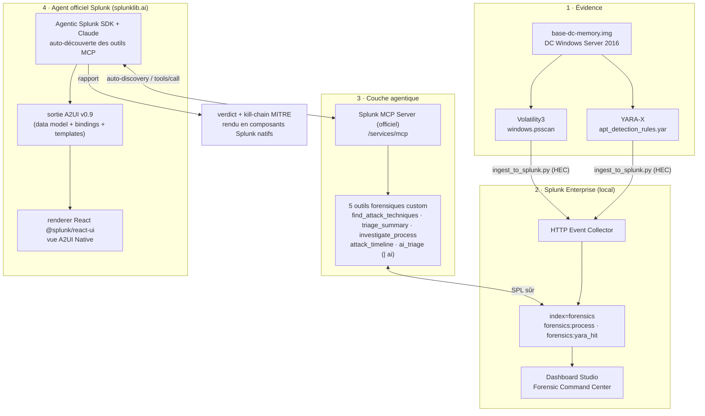

# Find Evil — Agentic Memory Forensics with Splunk

> **Splunk Agentic Ops Hackathon 2026 — piste Sécurité**
> Un agent IA qui investigue une image mémoire de contrôleur de domaine compromis en interrogeant Splunk en langage naturel, via le **Splunk MCP Server** officiel et des outils forensiques métier.

## Le problème

L'analyse de forensique mémoire est lente et réservée aux experts : monter le dump, lancer Volatility, scanner avec YARA, corréler à la main des centaines de processus et de hits. Pendant ce temps, l'attaquant exfiltre `NTDS.dit`.

## La solution

On transforme Splunk en **base de données forensique requêtable par un agent**. Les artefacts d'une image mémoire (processus, détections YARA mappées MITRE ATT&CK) sont ingérés dans un index Splunk, puis exposés à un agent LLM via le **Splunk MCP Server** et **4 outils forensiques custom**. L'analyste pose une question — *« ce contrôleur de domaine est-il compromis ? »* — et l'agent pivote, corrèle et produit un **rapport d'incident MITRE** en quelques secondes.

Cas de démonstration : `base-dc-memory.img` (5 Go), un DC Windows Server 2016 du scénario public **SRL-2018**, compromis par une chaîne d'exfiltration d'identifiants Active Directory.

## Architecture



> **Un seul agent, officiel** : l'**Agentic Splunk SDK** (`splunklib.ai`) se connecte au service Splunk, auto-découvre les outils du MCP Server et raisonne avec Claude. Sa sortie est rendue en texte (verdict) ou en **A2UI** natif (`@splunk/react-ui`).

## Composants

| Fichier | Rôle |
|---|---|
| [yara_scan.py](yara_scan.py) | Scan YARA-X de l'image mémoire → `artifacts/yara_hits.ndjson` |
| [vol_extract.sh](vol_extract.sh) | Extraction Volatility3 (processus) → `artifacts/*.json` |
| [ingest_to_splunk.py](ingest_to_splunk.py) | Pousse les artefacts vers l'index `forensics` via HEC |
| [forensic_mcp_tools.json](forensic_mcp_tools.json) | Définition des 5 outils MCP forensiques custom |
| [splunk_app/find_evil/bin/forensic_agent_sdk.py](splunk_app/find_evil/bin/forensic_agent_sdk.py) | **Agent officiel `splunklib.ai`** → verdict + kill-chain MITRE |
| [splunk_app/find_evil/bin/a2ui_agent.py](splunk_app/find_evil/bin/a2ui_agent.py) | Agent officiel → sortie **A2UI v0.9** (rendu React natif) |
| [rules/apt_detection_rules.yar](rules/apt_detection_rules.yar) | 15 règles APT (calibrées SRL-2018) |
| `forensics_ingest/` (app Splunk) | Index, HEC, dashboard *Forensic Command Center* |
| [splunk_app/find_evil/](splunk_app/find_evil/) | **App Splunk distribuable** : nav + dashboard *AI Investigation* (contrôles natifs pilotant `\| ai`) + *Command Center* |
| [forensic_ai_tool.json](forensic_ai_tool.json) | Outil MCP `ai_triage` (`\| ai` via AI Toolkit) |
| [AI_TOOLKIT_SETUP.md](AI_TOOLKIT_SETUP.md) | Procédure d'installation du AI Toolkit (PSC, rôle, connexion) |

## Capacités Splunk AI utilisées

- **Splunk MCP Server** (officiel, app Splunkbase 7931) — plan de contrôle de l'agent, expose les outils sur `/services/mcp`.
- **Outils MCP custom** — 5 outils forensiques métier enregistrés via `/services/mcp_tools`, qui traduisent des intentions d'investigation en SPL sûr.
- **Splunk AI Toolkit** (app Splunkbase 2890) — la commande SPL **`| ai`** fait analyser les détections par un LLM **directement dans le moteur Splunk** (outil `forensics_ai_triage`). L'IA devient partie du langage de recherche.
- **Agentic Splunk SDK** (`splunklib.ai`, SDK Python officiel 3.0) — un agent natif Splunk qui **auto-découvre les outils du MCP Server** et raisonne avec Claude, RBAC respecté. Voir [splunk_app/find_evil/bin/](splunk_app/find_evil/bin/).
- **Splunk AI Assistant (SAIA)** — les outils `generate_spl` / `explain_spl` / `ask_splunk_question` du serveur MCP restent disponibles pour l'analyste.

### L'agent officiel Splunk (`splunklib.ai`)
- [splunk_app/find_evil/bin/forensic_agent_sdk.py](splunk_app/find_evil/bin/forensic_agent_sdk.py) — l'**Agentic Splunk SDK** + Claude, **auto-découverte des outils MCP**, RBAC respecté. Sortie : verdict + kill-chain MITRE.
- [splunk_app/find_evil/bin/a2ui_agent.py](splunk_app/find_evil/bin/a2ui_agent.py) — le même agent en **sortie structurée**, convertie au format **A2UI v0.9** (https://a2ui.org : data model + bindings + templates), rendue en composants `@splunk/react-ui` natifs (vue *A2UI Native*).

## Les 5 outils forensiques (le différenciateur MCP)

| Outil | Question à laquelle il répond |
|---|---|
| `forensics_find_attack_techniques` | Quelles techniques d'attaque ont été détectées, par sévérité ? |
| `forensics_triage_summary` | Quelle est l'ampleur de la compromission (par MITRE) ? |
| `forensics_investigate_process` | Où est ce processus suspect (PID/PPID/session) ? |
| `forensics_attack_timeline` | Dans quel ordre l'attaque s'est-elle déroulée ? |
| `forensics_ai_triage` | **Verdict + kill-chain + remédiation** — analyse IA via `\| ai` (AI Toolkit → Claude) dans Splunk |

### `forensics_ai_triage` — l'IA dans le SPL

Cet outil exécute un SPL qui agrège les détections puis les passe au LLM via la commande
`\| ai` du Splunk AI Toolkit :

```spl
search index=forensics sourcetype=forensics:yara_hit
| eval line=severity.": ".rule." (".mitre.")"
| stats list(line) as dets | eval detections=mvjoin(dets, " | ")
| ai connection="claude" prompt="Analyste forensique: {detections}. Verdict + kill-chain MITRE + remédiation."
```

Le raisonnement IA est ainsi **natif au moteur Splunk**, et exposé à l'agent via le MCP Server.

## Installation

### Prérequis
- Splunk Enterprise 9.x/10.x en local (essai gratuit 60 j)
- App **Splunk MCP Server** (Splunkbase 7931) installée
- Python 3.11+, `brew install yara-x`

### Étapes
```bash
# 1. Environnement Python
python3 -m venv .venv && .venv/bin/pip install -r requirements.txt

# 2. Setup Splunk (index + HEC + tools MCP) — voir setup.sh pour le détail
./setup.sh

# 3. Extraction des artefacts depuis l'image mémoire
.venv/bin/python yara_scan.py        # scan YARA-X
./vol_extract.sh                     # extraction Volatility3

# 4. Ingestion dans Splunk
.venv/bin/python ingest_to_splunk.py

# 5. Investigation par l'agent officiel Splunk (splunklib.ai)
#    (SDK vendorisé dans l'app : pip install --target=splunk_app/find_evil/lib "splunk-sdk[ai,anthropic]")
SPLUNK_HOME=/Applications/Splunk SPLUNK_PASSWORD=... \
  python splunk_app/find_evil/bin/forensic_agent_sdk.py "Ce DC est-il compromis ?"
# ou produire l'A2UI rendu dans Splunk :
SPLUNK_HOME=/Applications/Splunk SPLUNK_PASSWORD=... \
  python splunk_app/find_evil/bin/a2ui_agent.py
```

### Connexion d'un client MCP (Claude Desktop / Code)
`.mcp.json` (gitignoré — contient le bearer token) :
```json
{
  "mcpServers": {
    "splunk-forensics": {
      "command": "npx",
      "args": ["-y", "mcp-remote", "https://localhost:8089/services/mcp",
               "--header", "Authorization: Bearer ${SPLUNK_MCP_TOKEN}"],
      "env": { "SPLUNK_MCP_TOKEN": "<token aud=mcp>", "NODE_TLS_REJECT_UNAUTHORIZED": "0" }
    }
  }
}
```
> Le token est un token d'autorisation Splunk standard avec **`audience=mcp`** (exigence du serveur).

## Exemple de sortie

```
## Verdict : COMPROMIS
4 détection(s) critique(s), 7 élevée(s) sur le contrôleur de domaine.

| Sévérité | Règle | MITRE |
|----------|-------|-------|
| critical | NTDS_Extraction_ntdsutil      | T1003.003 |
| critical | Credential_Dumping_Framework  | T1003.001 |
| critical | NTDS_Staging_Path             | T1074.001 |
| high     | PsExec_Remote_Execution       | T1021.002 |
| high     | WMI_Remote_Execution          | T1021.006, T1047 |
```

## Dashboard

**Forensic Command Center** (`forensics_ingest` app) : verdict, détections critiques, triage par sévérité, LOLBins en mémoire, chronologie, table MITRE.
`http://localhost:8000/en-US/app/forensics_ingest/forensic_command_center`

## Workflow SOC automatisé (Détecter → Investiguer → Automatiser)

Le cœur « piste Sécurité » : une **alerte Splunk planifiée** (`Find Evil - Auto Triage
Workflow`, toutes les 30 min) qui automatise la boucle SOC complète, sans intervention :

1. **Détecter** — recherche les détections YARA **critiques** dans l'index `forensics`.
2. **Investiguer** — déclenche le triage IA via la commande **`| ai`** (AI Toolkit →
   Claude) : verdict + kill-chain MITRE + actions de remédiation.
3. **Automatiser** — écrit un **incident notable** (`sourcetype=forensics:incident`)
   via `| collect`, visible dans le dashboard **SOC Incidents**.

```spl
index=forensics sourcetype=forensics:yara_hit
| stats list(...) as dets sum(eval(if(severity="critical",1,0))) as critical_count ...
| ai connection="claude" prompt="Analyste SOC: {detections}. Verdict + kill-chain MITRE + remédiation."
| where critical_count > 0
| collect index=forensics sourcetype=forensics:incident
```

Définition : [splunk_app/find_evil/default/savedsearches.conf](splunk_app/find_evil/default/savedsearches.conf).
> La saved search doit appartenir à un utilisateur ayant la capacité AI Toolkit
> (`apply_ai_commander_command`, via le rôle `mltk_admin`) pour que `| ai` s'exécute
> dans le contexte planifié.

## Architecture

Voir [ARCHITECTURE.md](ARCHITECTURE.md) pour le diagramme complet (interaction Splunk,
intégration des agents/modèles IA, flux de données entre services).

## Sécurité & bonnes pratiques (posture dev vs prod)

Aligné sur la doc Splunk (MCP Server + AI Toolkit). Conforme :
- **RBAC respecté** — `mcp_tool_execute` accordé par rôle ; toutes les interactions IA
  passent par le RBAC Splunk existant.
- **Safe-SPL** — les 5 outils n'utilisent que des commandes whitelistées ; templates
  SPL **figés**, paramètres validés par schéma `pattern` (pas de SPL arbitraire).
- **Contrôle au niveau serveur** — outils sensibles par défaut exclus ; nos outils
  activés explicitement.
- **Discrétion des données** — seules des **métadonnées de détection** (règle/sévérité/
  MITRE) sont envoyées au LLM, jamais de mémoire brute ni de PII.
- **Secrets** — `.mcp_token`, `.hec_token`, `.anthropic_key`, `.mcp.json` en chmod 600,
  gitignorés ; aucun secret en dur dans le code.

Écarts assumés (local/démo — à durcir en production) :
- Token MCP **Splunk standard `aud=mcp`** (vs token RSA-chiffré recommandé en prod).
- Certificat **auto-signé** + TLS client désactivé sur localhost (vs vrai certificat).
- `enable_risky_command_check_dashboard=false` pour afficher `| ai` (vs garde-fou activé).

## Licence

MIT — voir [LICENSE](LICENSE).
