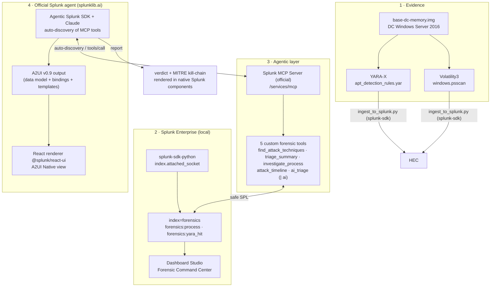

# Find Evil — Agentic Memory Forensics with Splunk

> **Splunk Agentic Ops Hackathon 2026 — Security track**
> An AI agent that investigates a compromised domain controller memory image by querying Splunk in natural language, via the official **Splunk MCP Server** and purpose-built forensic tools.

## The problem

Memory forensics is slow and reserved for experts: mount the dump, run Volatility, scan with YARA, and manually correlate hundreds of processes and hits. Meanwhile, the attacker exfiltrates `NTDS.dit`.

## The solution

We turn Splunk into a **forensic database that an agent can query**. The artifacts from a memory image (processes, YARA detections mapped to MITRE ATT&CK) are ingested into a Splunk index, then exposed to an LLM agent via the **Splunk MCP Server** and **4 custom forensic tools**. The analyst asks a question — *"is this domain controller compromised?"* — and the agent pivots, correlates, and produces a **MITRE incident report** in a few seconds.

Demonstration case: `base-dc-memory.img` (5 GB), a Windows Server 2016 DC from the public **SRL-2018** scenario, compromised by an Active Directory credential exfiltration chain.

## Architecture



> **A single, official agent**: the **Agentic Splunk SDK** (`splunklib.ai`) connects to the Splunk service, auto-discovers the MCP Server tools, and reasons with Claude. Its output is rendered as text (verdict) or native **A2UI** (`@splunk/react-ui`).

## Components

| File | Role |
|---|---|
| [yara_scan.py](yara_scan.py) | YARA-X scan of the memory image → `artifacts/yara_hits.ndjson` |
| [vol_extract.py](vol_extract.py) | Volatility3 extraction (processes) → `artifacts/*.json` |
| [ingest_to_splunk.py](ingest_to_splunk.py) | Pushes artifacts to the `forensics` index via HEC |
| [forensic_mcp_tools.json](forensic_mcp_tools.json) | Definition of the 5 custom forensic MCP tools |
| [splunk_app/find_evil/bin/forensic_agent_sdk.py](splunk_app/find_evil/bin/forensic_agent_sdk.py) | **Official `splunklib.ai` agent** → verdict + MITRE kill-chain |
| [splunk_app/find_evil/bin/a2ui_agent.py](splunk_app/find_evil/bin/a2ui_agent.py) | Official agent → **A2UI v0.9** output (native React rendering) |
| [rules/apt_detection_rules.yar](rules/apt_detection_rules.yar) | 15 APT rules (calibrated for SRL-2018) |
| `forensics_ingest/` (Splunk app) | Index, HEC, *Forensic Command Center* dashboard |
| [splunk_app/find_evil/](splunk_app/find_evil/) | **Distributable Splunk app**: nav + *AI Investigation* dashboard (native controls driving `\| ai`) + *Command Center* |
| [forensic_ai_tool.json](forensic_ai_tool.json) | `ai_triage` MCP tool (`\| ai` via the AI Toolkit) |
| [AI_TOOLKIT_SETUP.md](AI_TOOLKIT_SETUP.md) | AI Toolkit installation procedure (PSC, role, connection) |

## Splunk AI capabilities used

- **Splunk MCP Server** (official, Splunkbase app 7931) — the agent's control plane, exposes the tools on `/services/mcp`.
- **Custom MCP tools** — 5 purpose-built forensic tools registered via `/services/mcp_tools`, which translate investigation intents into safe SPL.
- **Splunk AI Toolkit** (Splunkbase app 2890) — the SPL command **`| ai`** has an LLM analyze the detections **directly inside the Splunk engine** (`forensics_ai_triage` tool). AI becomes part of the search language.
- **Agentic Splunk SDK** (`splunklib.ai`, official Python SDK 3.0) — a native Splunk agent that **auto-discovers the MCP Server tools** and reasons with Claude, with RBAC enforced. See [splunk_app/find_evil/bin/](splunk_app/find_evil/bin/).
- **Splunk AI Assistant (SAIA)** — the MCP server's `generate_spl` / `explain_spl` / `ask_splunk_question` tools remain available to the analyst.

### The official Splunk agent (`splunklib.ai`)
- [splunk_app/find_evil/bin/forensic_agent_sdk.py](splunk_app/find_evil/bin/forensic_agent_sdk.py) — the **Agentic Splunk SDK** + Claude, **auto-discovery of MCP tools**, RBAC enforced. Output: verdict + MITRE kill-chain.
- [splunk_app/find_evil/bin/a2ui_agent.py](splunk_app/find_evil/bin/a2ui_agent.py) — the same agent with **structured output**, converted to the **A2UI v0.9** format (https://a2ui.org: data model + bindings + templates), rendered as native `@splunk/react-ui` components (*A2UI Native* view).

## The 5 forensic tools (the MCP differentiator)

| Tool | Question it answers |
|---|---|
| `forensics_find_attack_techniques` | Which attack techniques were detected, by severity? |
| `forensics_triage_summary` | What is the scope of the compromise (by MITRE)? |
| `forensics_investigate_process` | Where is this suspicious process (PID/PPID/session)? |
| `forensics_attack_timeline` | In what order did the attack unfold? |
| `forensics_ai_triage` | **Verdict + kill-chain + remediation** — AI analysis via `\| ai` (AI Toolkit → Claude) inside Splunk |

### `forensics_ai_triage` — AI inside SPL

This tool runs an SPL search that aggregates the detections and then passes them to the LLM via the
`\| ai` command of the Splunk AI Toolkit:

```spl
search index=forensics sourcetype=forensics:yara_hit
| eval line=severity.": ".rule." (".mitre.")"
| stats list(line) as dets | eval detections=mvjoin(dets, " | ")
| ai connection="claude" prompt="Forensic analyst: {detections}. Verdict + MITRE kill-chain + remediation."
```

The AI reasoning is thus **native to the Splunk engine**, and exposed to the agent via the MCP Server.

## Installation

### Prerequisites
- Splunk Enterprise 9.x/10.x locally (free 60-day trial)
- **Splunk MCP Server** app (Splunkbase 7931) installed
- Python 3.11+, `brew install yara-x`

### Steps
```bash
# 1. Python environment
python3 -m venv .venv && .venv/bin/pip install -r requirements.txt

# 2. Splunk setup (index + HEC + MCP tools) — see setup.sh for details
./setup.sh

# 3. Extract artifacts from the memory image
.venv/bin/python yara_scan.py        # YARA-X scan
python vol_extract.py                     # Volatility3 extraction

# 4. Ingest into Splunk
.venv/bin/python ingest_to_splunk.py

# 5. Investigation by the official Splunk agent (splunklib.ai)
#    (SDK vendored in the app: pip install --target=splunk_app/find_evil/lib "splunk-sdk[ai,anthropic]")
SPLUNK_HOME=/Applications/Splunk SPLUNK_PASSWORD=... \
  python splunk_app/find_evil/bin/forensic_agent_sdk.py "Is this DC compromised?"
# or produce the A2UI rendered in Splunk:
SPLUNK_HOME=/Applications/Splunk SPLUNK_PASSWORD=... \
  python splunk_app/find_evil/bin/a2ui_agent.py
```

### Connecting an MCP client (Claude Desktop / Code)
`.mcp.json` (gitignored — contains the bearer token):
```json
{
  "mcpServers": {
    "splunk-forensics": {
      "command": "npx",
      "args": ["-y", "mcp-remote", "https://localhost:8089/services/mcp",
               "--header", "Authorization: Bearer ${SPLUNK_MCP_TOKEN}"],
      "env": { "SPLUNK_MCP_TOKEN": "<token aud=mcp>", "NODE_TLS_REJECT_UNAUTHORIZED": "0" }
    }
  }
}
```
> The token is a standard Splunk authorization token with **`audience=mcp`** (a server requirement).

## Example output

```
## Verdict: COMPROMISED
4 critical detection(s), 7 high on the domain controller.

| Severity | Rule | MITRE |
|----------|-------|-------|
| critical | NTDS_Extraction_ntdsutil      | T1003.003 |
| critical | Credential_Dumping_Framework  | T1003.001 |
| critical | NTDS_Staging_Path             | T1074.001 |
| high     | PsExec_Remote_Execution       | T1021.002 |
| high     | WMI_Remote_Execution          | T1021.006, T1047 |
```

## Dashboard

**Forensic Command Center** (`forensics_ingest` app): verdict, critical detections, triage by severity, in-memory LOLBins, timeline, MITRE table.
`http://localhost:8000/en-US/app/forensics_ingest/forensic_command_center`

## Automated SOC workflow (Detect → Investigate → Automate)

The heart of the "Security track": a **scheduled Splunk alert** (`Find Evil - Auto Triage
Workflow`, every 30 min) that automates the full SOC loop, with no intervention:

1. **Detect** — searches for **critical** YARA detections in the `forensics` index.
2. **Investigate** — triggers AI triage via the **`| ai`** command (AI Toolkit →
   Claude): verdict + MITRE kill-chain + remediation actions.
3. **Automate** — writes a **notable incident** (`sourcetype=forensics:incident`)
   via `| collect`, visible in the **SOC Incidents** dashboard.

```spl
index=forensics sourcetype=forensics:yara_hit
| stats list(...) as dets sum(eval(if(severity="critical",1,0))) as critical_count ...
| ai connection="claude" prompt="SOC analyst: {detections}. Verdict + MITRE kill-chain + remediation."
| where critical_count > 0
| collect index=forensics sourcetype=forensics:incident
```

Definition: [splunk_app/find_evil/default/savedsearches.conf](splunk_app/find_evil/default/savedsearches.conf).
> The saved search must belong to a user who has the AI Toolkit capability
> (`apply_ai_commander_command`, via the `mltk_admin` role) for `| ai` to run
> in the scheduled context.

## Architecture

See [ARCHITECTURE.md](ARCHITECTURE.md) for the full diagram (Splunk interaction,
AI agent/model integration, data flow between services).

## Security & best practices (dev vs prod posture)

Aligned with the Splunk documentation (MCP Server + AI Toolkit). Compliant:
- **RBAC enforced** — `mcp_tool_execute` granted by role; all AI interactions
  go through the existing Splunk RBAC.
- **Safe-SPL** — the 5 tools use only whitelisted commands; **frozen** SPL
  templates, parameters validated by `pattern` schema (no arbitrary SPL).
- **Server-level control** — sensitive tools excluded by default; our tools
  explicitly enabled.
- **Data discretion** — only **detection metadata** (rule/severity/
  MITRE) is sent to the LLM, never raw memory or PII.
- **Secrets** — `.mcp_token`, `.hec_token`, `.anthropic_key`, `.mcp.json` at chmod 600,
  gitignored; no hardcoded secrets in the code.

Accepted trade-offs (local/demo — to be hardened in production):
- Standard Splunk MCP token **`aud=mcp`** (vs the RSA-encrypted token recommended in prod).
- **Self-signed** certificate + client TLS disabled on localhost (vs a real certificate).
- `enable_risky_command_check_dashboard=false` to display `| ai` (vs the guardrail enabled).

## License

MIT — see [LICENSE](LICENSE).
